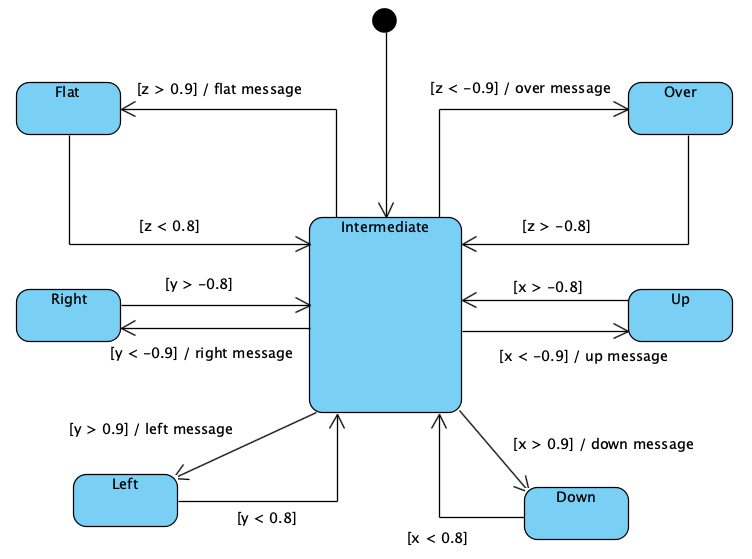
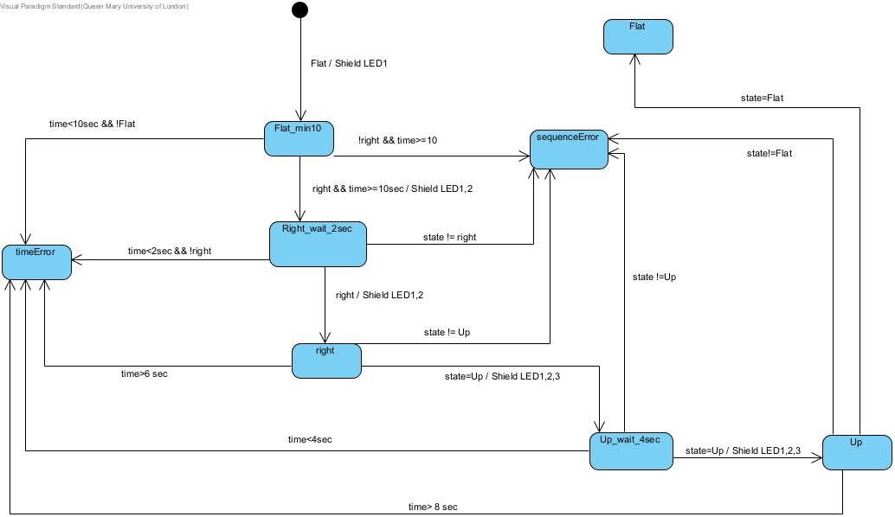

# Implemented code for lab 6
1. Activity 1: Download, read and run the sample project using the accelerometer and a terminal emulator (as in lab 5).
2. Activity 2: Detect the orientation of the development board.
3. Activity 3: Specify and implement a timed sequence of orientation states.
4. NOTE: Activity 3 is still under progress. It shows the transitions between the states but the flags/interupts has not been implemented in the code included
The project uses a single thread. But, we have created another thread for activity 3, since, activity 3 is not complete so we have commented out that thread for now.

The project includes the code for the serial interface. This API has two functions:
   1. `sendMsg` which write a message to the terminal
   2. `readLine` which reads a line from the terminal (not used here)

The project includes code for the accelerometer. This API has two functions:
   1. `initAccel` initialises the accelerometer
   2. `readXYZ` reads the three accelerations

The lab requirements include an implementation of the following state transition diagram:

